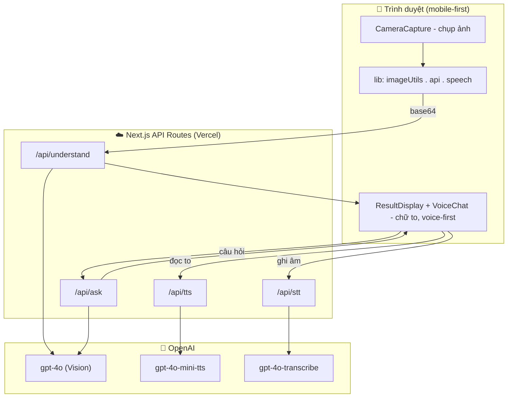

# 🔍 Soi Thuốc

> Trợ lý AI giúp người cao tuổi Việt Nam **đọc và hiểu** văn bản. Chỉ cần chụp ảnh nhãn thuốc, hóa đơn hay giấy tờ — ứng dụng **đọc to** và **giải thích lại bằng lời đời thường**.

🌐 **Demo:** https://codex-hackathon-six.vercel.app
🏆 Sản phẩm xây trong 1 ngày tại **Codex Hackathon**.

---

## 🩺 Vấn đề

Hàng triệu người cao tuổi Việt Nam khó đọc chữ nhỏ hoặc phức tạp — nhãn thuốc, công văn, hóa đơn, biểu mẫu. Google Lens hay kính lúp chỉ **phóng to** hoặc đọc **nguyên văn**, không giúp người dùng *hiểu* nội dung thật sự muốn nói gì.

## 💡 Giải pháp

Từ **một ảnh chụp**, Soi Thuốc:

1. 🔊 **Đọc to** nội dung bằng giọng tiếng Việt tự nhiên.
2. 💬 **Giải thích lại bằng lời đơn giản** — ví dụ "uống 2 viên × 3 lần/ngày sau ăn" → *"Mỗi ngày uống 3 lần, mỗi lần 2 viên, uống sau khi ăn cơm."*
3. 🎤 **Hỏi thêm bằng giọng nói** — trả lời dựa trên tờ giấy vừa chụp, hoặc bằng kiến thức chung (luôn kèm nhắc hỏi bác sĩ/dược sĩ khi liên quan sức khỏe).

Giao diện **voice-first**, chữ to, tương phản cao. Chạy hoàn toàn trên **web** — không cần cài đặt từ store (một rào cản lớn với người lớn tuổi).

## ✨ Tính năng

- 📷 Chụp ảnh bằng camera điện thoại (`<input capture>` — không cần cấp quyền phức tạp)
- 🤖 OCR + giải thích tiếng Việt trong **một lượt gọi** (GPT-4o Vision)
- 🔊 Đọc to **giọng nữ tự nhiên** (OpenAI TTS), tự fallback Web Speech khi cần
- 🎤 Hỏi đáp bằng giọng nói (STT) — grounded trong văn bản + bổ sung kiến thức chung
- ⚕️ Cảnh báo an toàn y tế tự động với nhãn thuốc
- 📱 Cài được như app (PWA: manifest + service worker)
- 🛡️ API routes có rate-limit, timeout, retry và thông báo lỗi tiếng Việt thân thiện

## 🏗️ Kiến trúc



**Luồng chính:** chụp → nén ảnh (`imageUtils`) → `/api/understand` (GPT-4o đọc + giải thích) → hiển thị chữ to + tự đọc to (`/api/tts`) → người dùng hỏi thêm bằng giọng nói (`/api/stt` → `/api/ask` → đọc câu trả lời).

## 🧰 Tech stack

| Lớp | Công nghệ |
|---|---|
| Framework | Next.js 16 (App Router) · React 19 · JavaScript |
| AI | OpenAI — `gpt-4o` (vision + Q&A), `gpt-4o-mini-tts` (đọc), `gpt-4o-transcribe` (nghe) |
| Giọng nói (fallback) | Web Speech API (SpeechSynthesis + SpeechRecognition) |
| UI | Vanilla CSS (tối ưu người lớn tuổi) · `lucide-react` |
| PWA | Web App Manifest + Service Worker |
| Hạ tầng | Vercel (HTTPS, auto-deploy từ `main`) |

## 📁 Cấu trúc thư mục

```
soi-thuoc/
├── public/
│   ├── icons/              # Icon PWA (192/512/maskable)
│   ├── manifest.json       # Cấu hình PWA
│   └── sw.js               # Service worker (cache app shell)
├── src/
│   ├── app/
│   │   ├── api/
│   │   │   ├── understand/ # Ảnh -> text gốc + giải thích
│   │   │   ├── ask/        # Hỏi đáp grounded + kiến thức chung
│   │   │   ├── tts/        # Text -> giọng đọc (mp3)
│   │   │   └── stt/        # Ghi âm -> text
│   │   ├── layout.js       # Layout gốc + metadata + PWA
│   │   ├── page.js         # Glue: nối camera -> API -> hiển thị -> giọng nói
│   │   └── globals.css     # Design system
│   ├── components/         # CameraCapture, ResultDisplay, VoiceChat, ...
│   └── lib/
│       ├── api.js          # Client gọi API (timeout/hủy/retry)
│       ├── imageUtils.js   # Nén ảnh + xử lý xoay EXIF
│       ├── speech.js       # TTS (OpenAI + Web Speech) & STT
│       └── registerPwa.js  # Đăng ký service worker
├── .env.example
└── README.md
```

## 🔌 API Routes

| Route | Method | Đầu vào | Đầu ra | Model |
|---|---|---|---|---|
| `/api/understand` | POST | `{ image: base64 }` | `{ raw_text, type, explanation, key_points }` | `gpt-4o` |
| `/api/ask` | POST | `{ question, raw_text }` | `{ answer, grounded }` | `gpt-4o` |
| `/api/tts` | POST | `{ text, voice? }` | `audio/mpeg` (mp3) | `gpt-4o-mini-tts` |
| `/api/stt` | POST | `FormData { audio }` | `{ text }` | `gpt-4o-transcribe` |

## 🚀 Bắt đầu

**Yêu cầu:** Node.js 18+ và một OpenAI API key.

```bash
# 1. Cài dependencies
npm install

# 2. Tạo file .env và điền khóa
cp .env.example .env
#   rồi sửa: OPENAI_API_KEY=sk-...

# 3. Chạy dev
npm run dev          # http://localhost:3000
```

> 🎤 **Mic chỉ chạy trên ngữ cảnh bảo mật (HTTPS hoặc localhost).** Test mic trên `localhost` (máy tính) hoặc trên bản deploy HTTPS; mở qua IP LAN `http://192.168...` thì trình duyệt sẽ chặn micro.

## 🔑 Biến môi trường

| Biến | Bắt buộc | Mặc định | Ý nghĩa |
|---|---|---|---|
| `OPENAI_API_KEY` | ✅ | — | Khóa OpenAI (chỉ dùng phía server) |
| `OPENAI_MODEL` | ❌ | `gpt-4o` | Model cho understand & ask |
| `OPENAI_STT_MODEL` | ❌ | `gpt-4o-transcribe` | Model nhận giọng nói |

Ngoài ra mỗi route có sẵn các biến tinh chỉnh timeout / rate-limit (ví dụ `ASK_RATE_LIMIT_MAX`, `UNDERSTAND_OPENAI_TIMEOUT_MS`...) — đều có giá trị mặc định hợp lý, không cần đặt nếu không có nhu cầu.

## ☁️ Deploy (Vercel)

1. Đăng nhập **vercel.com** bằng GitHub → **Add New → Project** → import repo này.
2. Vercel tự nhận Next.js (không cần chỉnh build).
3. **Thêm Environment Variable `OPENAI_API_KEY`** (file `.env` bị gitignore nên không có trong repo — thiếu bước này mọi API trả lỗi 503).
4. **Deploy.** Từ đó, mỗi lần push lên `main` Vercel **tự build & deploy lại**.

## ⚠️ Lưu ý

- 🩺 **Không phải lời khuyên y tế.** Với nhãn thuốc, ứng dụng luôn nhắc *"Nếu chưa chắc, hãy hỏi lại bác sĩ hoặc dược sĩ."*
- 🔒 OpenAI API key **chỉ nằm ở server** (API routes), không bao giờ lộ ra client. Ảnh người dùng xử lý trong bộ nhớ, không lưu trữ.

## 👥 Đội ngũ

| Vai trò | Phụ trách |
|---|---|
| **A** — Backend | API routes (understand / ask / tts / stt), tích hợp OpenAI |
| **B** — UI/UX | Design system + components, giao diện tối ưu người lớn tuổi |
| **C** — Voice & Integration | `speech.js` (TTS/STT), `imageUtils`, `api.js`, glue `page.js`, PWA & deploy |

---

<p align="center">Made with ❤️ for ông bà · Codex Hackathon 2026</p>
