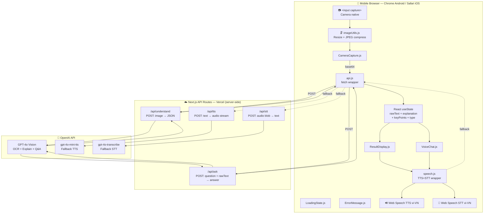
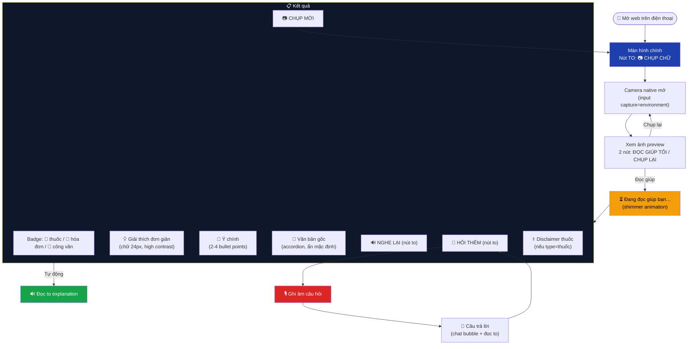
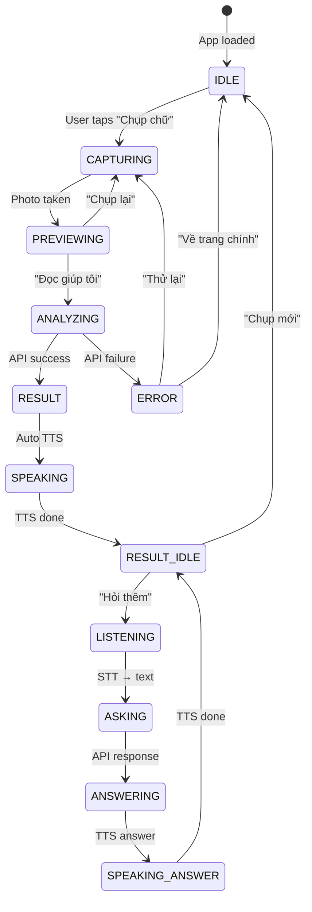
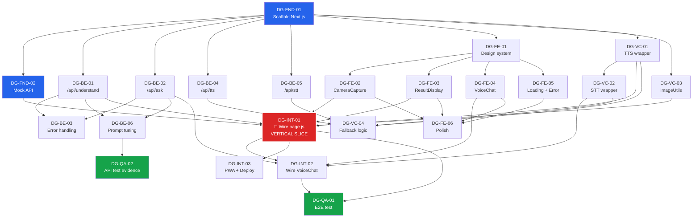

# 📖 Đọc Giúp — Kiến trúc tổng & Phân chia công việc

> **Trợ lý đọc hiểu văn bản cho người Việt Nam lớn tuổi**
> Hackathon 1 ngày · 3 thành viên · All-OpenAI stack · Next.js + Vercel

---

## 1. Tổng quan kiến trúc

### 1.1 System Architecture



### 1.2 User Flow



### 1.3 State Machine



---

## 2. Domain Model

### 2.1 Data Structures

```typescript
// === API Contracts ===

// POST /api/understand
interface UnderstandRequest {
  image: string; // base64 JPEG, max ~200KB after compress
}
interface UnderstandResponse {
  raw_text: string;       // Văn bản gốc, giữ đúng dấu
  type: "thuốc" | "hóa đơn" | "công văn" | "biểu mẫu" | "khác";
  explanation: string;    // Giải thích đơn giản, ngôn ngữ đời thường
  key_points: string[];   // 2-4 ý quan trọng nhất
}

// POST /api/ask
interface AskRequest {
  question: string;       // Câu hỏi của user (text)
  raw_text: string;       // Văn bản gốc (context grounding)
}
interface AskResponse {
  answer: string;         // Câu trả lời grounded
}

// POST /api/tts (fallback)
interface TtsRequest {
  text: string;           // Text cần đọc
  voice?: string;         // Default: "coral"
}
// Response: audio/mpeg stream

// POST /api/stt (fallback)
// Request: FormData with "audio" file (webm/mp4)
interface SttResponse {
  text: string;           // Transcribed Vietnamese text
}
```

### 2.2 Component Props Contract

```typescript
// CameraCapture
interface CameraCaptureProps {
  onCapture: (base64: string) => void;
  disabled?: boolean;
}

// ResultDisplay
interface ResultDisplayProps {
  rawText: string;
  type: "thuốc" | "hóa đơn" | "công văn" | "biểu mẫu" | "khác";
  explanation: string;
  keyPoints: string[];
  onListenAgain: () => void;
  onNewCapture: () => void;
}

// VoiceChat
interface VoiceChatProps {
  rawText: string;          // Context for grounding
  messages: ChatMessage[];
  onSendMessage: (question: string) => void;
  isProcessing: boolean;
}
interface ChatMessage {
  role: "user" | "assistant";
  text: string;
}

// LoadingState
interface LoadingStateProps {
  message?: string;         // Default: "Đang đọc giúp bạn…"
}
```

### 2.3 Speech Library Contract

```typescript
// src/lib/speech.js
speak(text: string): Promise<void>
  // Ưu tiên Web Speech vi-VN (rate 0.85)
  // Fallback: fetch /api/tts → play audio

stopSpeaking(): void

startListening(): Promise<string>
  // Ưu tiên Web Speech Recognition vi-VN
  // Fallback: MediaRecorder → POST /api/stt

stopListening(): void

hasVietnameseVoice(): boolean
hasSpeechRecognition(): boolean
```

---

## 3. Tech Stack & Quyết định

| Quyết định | Chọn | Thay vì | Lý do |
|---|---|---|---|
| Camera | `<input capture="environment">` | `getUserMedia` | Native camera, 0 bug iOS, mọi điện thoại |
| OCR | GPT-4o vision (1 call) | Tesseract + LLM (2 call) | Bỏ pipeline; dấu tiếng Việt tốt hơn |
| Framework | Next.js 14 App Router | Vite + Express | API route giấu key, deploy 1 phút |
| State | React useState | Redux/Zustand | Chỉ 1 page, ~5 state vars |
| TTS chính | Web Speech API vi-VN | OpenAI TTS | Giọng Việt bản địa, 0 latency, miễn phí |
| TTS fallback | gpt-4o-mini-tts | Google TTS | Cùng API key, không thêm credential |
| STT chính | Web Speech Recognition vi-VN | OpenAI STT | Miễn phí, realtime trên Chrome Android |
| STT fallback | gpt-4o-transcribe | — | Cho iOS Safari không hỗ trợ Web Speech |
| Deploy | Vercel | Render/Railway | Deploy 1 click, HTTPS, free tier |
| Styling | Vanilla CSS | Tailwind | Full control cho elderly-optimized design |
| Grounding | Nhét raw_text vào prompt | RAG/Vector DB | Chỉ 1 "tài liệu" duy nhất |

---

## 4. Cấu trúc thư mục & File Ownership

```
codex-hackathon/
├── package.json                             # A setup
├── next.config.js                           # A setup
├── .env.local                               # A (OPENAI_API_KEY)
├── .gitignore                               # A setup
│
├── public/                                  # C owns
│   ├── manifest.json                        # C
│   ├── sw.js                                # C
│   └── icons/                               # C
│       ├── icon-192.png
│       └── icon-512.png
│
├── src/
│   ├── app/
│   │   ├── layout.js                        # B owns
│   │   ├── page.js                          # C owns (glue logic)
│   │   ├── globals.css                      # B owns
│   │   │
│   │   └── api/                             # A owns (entire folder)
│   │       ├── understand/
│   │       │   └── route.js                 # A
│   │       ├── ask/
│   │       │   └── route.js                 # A
│   │       ├── tts/
│   │       │   └── route.js                 # A
│   │       └── stt/
│   │           └── route.js                 # A
│   │
│   ├── components/                          # B owns (entire folder)
│   │   ├── CameraCapture.js                 # B
│   │   ├── ResultDisplay.js                 # B
│   │   ├── VoiceChat.js                     # B
│   │   ├── LoadingState.js                  # B
│   │   └── ErrorMessage.js                  # B
│   │
│   └── lib/                                 # C owns (entire folder)
│       ├── speech.js                        # C
│       ├── imageUtils.js                    # C
│       └── api.js                           # C
│
└── docs/
    └── architecture.md                      # This file
```

> [!CAUTION]
> **Quy tắc vàng**: Mỗi người CHỈ edit files mình own. Nếu cần thay đổi interface, nói trong group chat TRƯỚC, không tự đổi.

---

## 5. Git Strategy

```
main                ← chỉ merge code đã test
├── feat/backend    ← Person A
├── feat/ui         ← Person B
└── feat/voice      ← Person C
```

- Mỗi người làm trên branch riêng
- Tại sync point → merge vào `main` theo thứ tự: A → B → C
- Person C merge cuối (C là integrator, hiểu full picture)
- Conflict → C resolve

---

## 6. Sync Points & Critical Path

```mermaid
gantt
    title Critical Path — 3 người song song (10 giờ)
    dateFormat HH:mm
    axisFormat %H:%M

    section Sync Points
    🟢 SYNC 0 - Scaffold ready    :milestone, m0, 00:30, 0m
    🔴 SYNC 1 - Vertical Slice    :milestone, m1, 04:00, 0m
    🟡 SYNC 2 - Full Integration   :milestone, m2, 06:30, 0m
    🔵 SYNC 3 - Demo Ready        :milestone, m3, 09:00, 0m

    section 👤 A — Backend
    DG-FND-01 Scaffold             :a0, 00:00, 30m
    DG-BE-01 /api/understand       :a1, 00:30, 90m
    DG-BE-02 /api/ask              :a2, 02:00, 60m
    DG-BE-03 Error handling        :a3, 03:00, 60m
    DG-BE-04 /api/tts              :a4, 04:00, 60m
    DG-BE-05 /api/stt              :a5, 05:00, 60m
    DG-BE-06 Prompt tuning         :a6, 06:00, 90m
    DG-QA-02 API test evidence     :a7, 07:30, 90m

    section 👤 B — UI/UX
    DG-FE-01 Design system CSS     :b0, 00:30, 60m
    DG-FE-02 CameraCapture        :b1, 01:30, 90m
    DG-FE-03 ResultDisplay        :b2, 03:00, 90m
    DG-FE-04 VoiceChat UI         :b3, 04:30, 90m
    DG-FE-05 Loading + Error      :b4, 06:00, 60m
    DG-FE-06 Polish + animations  :b5, 07:00, 120m

    section 👤 C — Voice + Glue
    DG-VC-01 TTS wrapper           :c0, 00:30, 90m
    DG-VC-02 STT wrapper           :c1, 02:00, 60m
    DG-VC-03 imageUtils            :c2, 03:00, 30m
    DG-INT-01 Wire page.js         :crit, c3, 03:30, 90m
    DG-INT-02 Wire VoiceChat       :c4, 05:00, 90m
    DG-VC-04 Fallback logic        :c5, 06:30, 60m
    DG-INT-03 PWA + Deploy         :c6, 07:30, 60m
    DG-QA-01 E2E test              :c7, 08:30, 60m
```



| Sync | Giờ | Điều kiện | Ai cần merge |
|---|---|---|---|
| **SYNC 0** | 0:30 | Repo ready, mock API chạy, cả 3 `npm run dev` OK | A push → B, C pull |
| **SYNC 1** 🎯 | 4:00 | **Chụp → Hiểu → Đọc to** chạy end-to-end | A, B, C merge → main |
| **SYNC 2** | 6:30 | Voice Q&A hoạt động, UI polish xong | A, B, C merge → main |
| **SYNC 3** | 9:00 | Demo ready, 3 mẫu test pass | Final merge, deploy |

> [!IMPORTANT]
> **Quy tắc vàng**: Vertical slice (chụp → hiểu → đọc to) PHẢI chạy trước giờ thứ 4. Mọi thứ sau đó là nâng cấp có thể cắt.

---

## 7. MoSCoW — Phạm vi cắt

| Ưu tiên | Tasks | Ghi chú |
|---|---|---|
| **Must** ⭐ | DG-FND-*, DG-BE-01/02/03, DG-FE-01/02/03, DG-VC-01/03, DG-INT-01 | Vertical slice — demo tối thiểu gây ấn tượng |
| **Should** | DG-FE-04, DG-VC-02, DG-INT-02, DG-FE-05 | Voice Q&A + error handling |
| **Could** | DG-BE-04/05, DG-VC-04, DG-FE-06, DG-INT-03, DG-QA-* | TTS/STT fallback, PWA, polish, test |
| **Won't** | Tài khoản, lưu cloud, đa ngôn ngữ, live stream, offline | Không làm lần này |

---

## 8. Task Board chi tiết

### 8.0 Foundation — Setup (cả 3 cùng làm)

---

| Field | Value |
|---|---|
| **ID** | DG-FND-01 |
| **Module** | 0. Foundation |
| **Tên công việc** | Scaffold Next.js + deploy skeleton |
| **Mục đích** | Tạo repo chung, cài dependencies, có URL live để cả 3 bắt đầu ngay |
| **Mô tả chi tiết** | `npx create-next-app@latest ./` với App Router, no TypeScript (hackathon speed), no Tailwind. Cài `openai`. Tạo `.env.local` với `OPENAI_API_KEY`. Push lên GitHub. Deploy lên Vercel. Verify URL live trên điện thoại thật. |
| **Owner** | **Person A** |
| **Files** | `package.json`, `next.config.js`, `.env.local`, `.gitignore` |
| **Deps** | None |
| **Deadline** | Giờ 0:30 |
| **Acceptance Criteria** | `npm run dev` chạy thành công trên máy cả 3 người; Vercel URL mở được trên điện thoại; `.env.local` có key hợp lệ |
| **Definition of Done** | Repo trên GitHub; 3 người clone + run OK; Vercel deploy thành công; mock API trả được response |
| **Risk** | Vercel deploy lần đầu có thể cần link GitHub — làm trước ở nhà nếu được |

---

| Field | Value |
|---|---|
| **ID** | DG-FND-02 |
| **Module** | 0. Foundation |
| **Tên công việc** | Mock API cho develop song song |
| **Mục đích** | B và C có thể test UI/speech ngay mà không cần đợi A hoàn thành GPT-4o integration |
| **Mô tả chi tiết** | Tạo `/api/understand/route.js` và `/api/ask/route.js` trả hardcoded JSON response theo đúng contract ở mục 2.1. Response mock dùng ví dụ nhãn thuốc Paracetamol. Thêm `await new Promise(r => setTimeout(r, 1500))` giả lập latency. |
| **Owner** | **Person A** |
| **Files** | `src/app/api/understand/route.js`, `src/app/api/ask/route.js` |
| **Deps** | DG-FND-01 |
| **Deadline** | Giờ 0:30 |
| **Acceptance Criteria** | `curl -X POST http://localhost:3000/api/understand` trả JSON đúng format; response có delay ~1.5s; B và C gọi được từ frontend |
| **Definition of Done** | Mock API merge vào main; B và C xác nhận gọi được |
| **Risk** | Không có — chỉ là hardcode JSON |

---

### 8.1 Backend API — Person A

---

| Field | Value |
|---|---|
| **ID** | DG-BE-01 |
| **Module** | 1. Backend API |
| **Tên công việc** | `/api/understand` — GPT-4o Vision OCR + Giải thích |
| **Mục đích** | Core feature: nhận ảnh văn bản → trả về text gốc + giải thích đơn giản + ý chính. Đây là trái tim của sản phẩm. |
| **Mô tả chi tiết** | Thay mock bằng real GPT-4o call. Nhận base64 image từ body. Gửi tới `gpt-4o` với `response_format: { type: "json_object" }`. System prompt tại mục Prompt Design bên dưới. Parse JSON response, validate có đủ 4 fields. Trả 200 với structured response hoặc 500 với error message tiếng Việt. Timeout 30s. |
| **Owner** | **Person A** |
| **Files** | `src/app/api/understand/route.js` |
| **Deps** | DG-FND-01 |
| **Deadline** | Giờ 2:00 |
| **Acceptance Criteria** | Gửi ảnh nhãn thuốc → nhận JSON có `raw_text` đúng dấu tiếng Việt, `type` = "thuốc", `explanation` dùng ngôn ngữ đơn giản, `key_points` có 2-4 items; gửi ảnh không có text → trả lỗi hoặc `raw_text` rỗng với explanation phù hợp |
| **Definition of Done** | Test thủ công qua curl với 3 loại ảnh (thuốc, hóa đơn, công văn); response đúng contract; error case trả message tiếng Việt; API key không lộ trong response |
| **Risk** | GPT-4o có thể trả JSON invalid → cần try-catch parse + retry 1 lần |

---

| Field | Value |
|---|---|
| **ID** | DG-BE-02 |
| **Module** | 1. Backend API |
| **Tên công việc** | `/api/ask` — Hỏi đáp grounded trong văn bản |
| **Mục đích** | Cho phép user hỏi follow-up về văn bản đã chụp; câu trả lời CHỈ dựa trên text gốc, không bịa thêm |
| **Mô tả chi tiết** | Nhận `{question, raw_text}` từ body. Gọi `gpt-4o` (text mode) với system prompt grounding nghiêm ngặt. raw_text được nhét vào prompt làm context duy nhất. Prompt phải có chỉ thị: nếu câu hỏi ngoài phạm vi → trả "Tờ giấy này không ghi điều đó." Trả `{answer}`. |
| **Owner** | **Person A** |
| **Files** | `src/app/api/ask/route.js` |
| **Deps** | DG-FND-01 |
| **Deadline** | Giờ 3:00 |
| **Acceptance Criteria** | Hỏi "uống lúc nào" với raw_text thuốc → trả lời đúng từ text; hỏi "thuốc có tác dụng phụ gì" khi text không ghi → trả "Tờ giấy này không ghi điều đó"; không suy đoán thông tin y tế ngoài text |
| **Definition of Done** | Test 5 câu hỏi: 3 có trong text + 2 ngoài phạm vi; grounding hoạt động; response bằng tiếng Việt đơn giản |
| **Risk** | LLM có thể hallucinate y tế → prompt phải đủ nghiêm ngặt; test kỹ |

---

| Field | Value |
|---|---|
| **ID** | DG-BE-03 |
| **Module** | 1. Backend API |
| **Tên công việc** | Error handling & input validation |
| **Mục đích** | Đảm bảo API không crash khi nhận input xấu; user luôn nhận được thông báo lỗi thân thiện |
| **Mô tả chi tiết** | Validate body: image phải là string non-empty, question phải là string non-empty, raw_text phải là string. Kiểm tra base64 hợp lệ. Giới hạn image size (< 5MB base64). Bắt lỗi OpenAI: timeout, rate limit, invalid key, content filter. Mỗi lỗi có message tiếng Việt thân thiện. Trả đúng HTTP status code. |
| **Owner** | **Person A** |
| **Files** | `src/app/api/understand/route.js`, `src/app/api/ask/route.js` |
| **Deps** | DG-BE-01, DG-BE-02 |
| **Deadline** | Giờ 4:00 |
| **Acceptance Criteria** | Body rỗng → 400 + message VN; ảnh quá lớn → 413 + "Ảnh quá lớn, bạn thử chụp lại"; OpenAI timeout → 504 + "Đang bận, thử lại sau"; API key hết credit → 503 + message phù hợp |
| **Definition of Done** | Mỗi error case có test curl; không có stack trace trong response; message luôn bằng tiếng Việt |
| **Risk** | Dễ quên edge case — làm danh sách error codes trước |

---

| Field | Value |
|---|---|
| **ID** | DG-BE-04 |
| **Module** | 1. Backend API |
| **Tên công việc** | `/api/tts` — OpenAI TTS fallback |
| **Mục đích** | Fallback đọc to khi thiết bị không có giọng vi-VN trong Web Speech API |
| **Mô tả chi tiết** | Nhận `{text, voice?}` từ body. Gọi OpenAI `audio.speech.create` với model `gpt-4o-mini-tts`, voice `coral` (hoặc param), input text, response_format `mp3`. Stream audio response về client. |
| **Owner** | **Person A** |
| **Files** | `src/app/api/tts/route.js` |
| **Deps** | DG-FND-01 |
| **Deadline** | Giờ 5:00 |
| **Acceptance Criteria** | `curl -X POST -d '{"text":"Xin chào bạn"}' > test.mp3` → file mp3 nghe được tiếng Việt; text dài (200 từ) → stream hoàn tất < 5s |
| **Definition of Done** | API hoạt động; C có thể gọi từ speech.js fallback; text rỗng trả 400 |
| **Risk** | Could priority — chỉ làm nếu đủ thời gian. Vertical slice không cần |

---

| Field | Value |
|---|---|
| **ID** | DG-BE-05 |
| **Module** | 1. Backend API |
| **Tên công việc** | `/api/stt` — Whisper fallback |
| **Mục đích** | Fallback nhận giọng nói cho iOS Safari (không hỗ trợ Web Speech Recognition) |
| **Mô tả chi tiết** | Nhận FormData với field `audio` (webm/mp4 blob). Gọi OpenAI `audio.transcriptions.create` với model `gpt-4o-transcribe`, language `vi`. Trả `{text}`. |
| **Owner** | **Person A** |
| **Files** | `src/app/api/stt/route.js` |
| **Deps** | DG-FND-01 |
| **Deadline** | Giờ 6:00 |
| **Acceptance Criteria** | Gửi audio tiếng Việt → nhận text đúng; audio tiếng ồn → trả text rỗng hoặc lỗi phù hợp |
| **Definition of Done** | API hoạt động; C có thể gọi từ speech.js fallback |
| **Risk** | Could priority — cần MediaRecorder ở client (C phải hỗ trợ) |

---

| Field | Value |
|---|---|
| **ID** | DG-BE-06 |
| **Module** | 1. Backend API |
| **Tên công việc** | Prompt tuning + test đa loại văn bản |
| **Mục đích** | Đảm bảo prompt GPT-4o cho kết quả tốt với nhiều loại văn bản thực tế người Việt gặp hàng ngày |
| **Mô tả chi tiết** | Chuẩn bị 5-8 ảnh test: nhãn thuốc (nhiều loại), hóa đơn điện, hóa đơn nước, giấy hẹn khám, công văn/thông báo, biểu mẫu đăng ký. Test từng ảnh qua API. Đánh giá: dấu tiếng Việt có đúng không, giải thích có đơn giản không, key_points có hữu ích không, type có đúng không. Tinh chỉnh prompt dựa trên kết quả. Ghi lại evidence (input → output). |
| **Owner** | **Person A** |
| **Files** | Prompt text trong `src/app/api/understand/route.js`, `src/app/api/ask/route.js` |
| **Deps** | DG-BE-01, DG-BE-02 |
| **Deadline** | Giờ 7:30 |
| **Acceptance Criteria** | ≥5 loại văn bản cho kết quả đúng type, explanation dễ hiểu; nhãn thuốc giải thích rõ liều lượng, thời gian, cách uống; hóa đơn tóm tắt đúng số tiền |
| **Definition of Done** | Evidence file ghi input/output/đánh giá; prompt version final được commit |
| **Risk** | Prompt sensitivity — thay đổi nhỏ có thể ảnh hưởng output. Luôn test lại tất cả ảnh sau khi sửa prompt |

---

### 8.2 Frontend UI/UX — Person B

---

| Field | Value |
|---|---|
| **ID** | DG-FE-01 |
| **Module** | 2. Frontend UI/UX |
| **Tên công việc** | Design system CSS — elderly-optimized |
| **Mục đích** | Xây nền tảng styling nhất quán: dark mode, chữ to, nút to, contrast cao, phù hợp người lớn tuổi |
| **Mô tả chi tiết** | Định nghĩa CSS custom properties: `--font-size-body: 20px`, `--font-size-heading: 32px`, `--font-size-result: 24px`, `--btn-min-size: 56px`. Dark palette: bg `#0a0a14`, surface `#16182a`, primary `#60a5fa`, accent `#f97316`, text `#f1f5f9`. Contrast ratio ≥ 7:1 (WCAG AAA). Google Fonts Inter (hỗ trợ tiếng Việt). Reset/normalize. Button base styles. Card/surface styles với glassmorphism nhẹ. Responsive utilities. Animations: shimmer, pulse, fade-in. |
| **Owner** | **Person B** |
| **Files** | `src/app/globals.css`, `src/app/layout.js` |
| **Deps** | DG-FND-01 |
| **Deadline** | Giờ 1:30 |
| **Acceptance Criteria** | Không có text < 18px ở bất kỳ đâu; nút bấm ≥ 56×56px; contrast ratio ≥ 7:1 cho text chính; Inter font load đúng tiếng Việt; dark mode không chói mắt; glassmorphism card hiển thị đúng trên Chrome Android |
| **Definition of Done** | Layout.js có metadata tiếng Việt, font Inter, viewport meta mobile; globals.css có đầy đủ tokens + base styles + animations; preview trên mobile simulator OK |
| **Risk** | Inter font phải load subset tiếng Việt — kiểm tra dấu hiển thị đúng |

---

| Field | Value |
|---|---|
| **ID** | DG-FE-02 |
| **Module** | 2. Frontend UI/UX |
| **Tên công việc** | CameraCapture component |
| **Mục đích** | Cho phép user chụp ảnh văn bản bằng camera native, xem preview, và quyết định gửi phân tích hoặc chụp lại |
| **Mô tả chi tiết** | Dùng `<input type="file" accept="image/*" capture="environment">` thay vì getUserMedia. Khi user chọn ảnh → hiển thị preview trong ``. 2 nút lớn: "📖 ĐỌC GIÚP TÔI" (primary, accent color) và "📷 CHỤP LẠI" (secondary). Trước khi chụp: hiển thị nút "📷 CHỤP CHỮ" full-width, rất to. Gọi `onCapture(base64)` khi user confirm. Component KHÔNG tự compress ảnh (C làm trong imageUtils). |
| **Owner** | **Person B** |
| **Files** | `src/components/CameraCapture.js` |
| **Deps** | DG-FE-01 |
| **Deadline** | Giờ 3:00 |
| **Acceptance Criteria** | Bấm "CHỤP CHỮ" → mở camera native trên Android Chrome; chụp xong → thấy preview; bấm "ĐỌC GIÚP TÔI" → gọi `onCapture` với file object; bấm "CHỤP LẠI" → reset về trạng thái ban đầu; nút ≥ 56px height; hoạt động trên cả iOS Safari |
| **Definition of Done** | Component render đúng 2 trạng thái (before/after capture); props interface match contract; test trên Chrome Android + iOS Safari simulator |
| **Risk** | `capture="environment"` trên iOS đôi khi mở photo library thay vì camera — cần test thực tế |

---

| Field | Value |
|---|---|
| **ID** | DG-FE-03 |
| **Module** | 2. Frontend UI/UX |
| **Tên công việc** | ResultDisplay component |
| **Mục đích** | Hiển thị kết quả phân tích bằng chữ to, rõ ràng, dễ đọc cho người lớn tuổi |
| **Mô tả chi tiết** | Nhận props: `{rawText, type, explanation, keyPoints, onListenAgain, onNewCapture}`. Hiển thị: (1) Badge type với emoji (💊 thuốc, 🧾 hóa đơn, 📄 công văn, 📋 biểu mẫu, 📝 khác); (2) `explanation` trong card lớn, font 24px; (3) `keyPoints` dạng danh sách có icon ✅; (4) Accordion "📝 Xem văn bản gốc" (ẩn mặc định); (5) Nút "🔊 NGHE LẠI" to; (6) Nút "📷 CHỤP MỚI"; (7) Nếu type === "thuốc": disclaimer "⚕️ Nếu chưa chắc, hãy hỏi bác sĩ hoặc dược sĩ." |
| **Owner** | **Person B** |
| **Files** | `src/components/ResultDisplay.js` |
| **Deps** | DG-FE-01 |
| **Deadline** | Giờ 4:30 |
| **Acceptance Criteria** | Nhận mock data → render đầy đủ badge + explanation + keyPoints + accordion; chữ explanation ≥ 24px; disclaimer hiện khi type="thuốc", ẩn khi type khác; nút "NGHE LẠI" và "CHỤP MỚI" hoạt động; accordion toggle smooth; responsive trên màn hình 5" đến 6.7" |
| **Definition of Done** | Component render đúng với mock data; props interface match contract; không có text < 18px; screenshot evidence trên mobile viewport |
| **Risk** | Key points list dài có thể tràn — cần giới hạn hoặc scroll |

---

| Field | Value |
|---|---|
| **ID** | DG-FE-04 |
| **Module** | 2. Frontend UI/UX |
| **Tên công việc** | VoiceChat component |
| **Mục đích** | Giao diện hỏi đáp bằng giọng nói: nút mic, chat bubbles, text input fallback |
| **Mô tả chi tiết** | Nhận props: `{rawText, messages, onSendMessage, isProcessing}`. Hiển thị: (1) Danh sách chat bubbles — user bên phải (accent), assistant bên trái (surface); (2) Nút "🎤 HỎI THÊM" to, có pulse animation khi `isProcessing`; (3) Text input fallback kèm nút gửi (cho iOS/thiết bị không có mic); (4) Message "Đang trả lời…" khi processing. Component KHÔNG tự gọi speech — chỉ gọi `onSendMessage(text)` khi user submit. |
| **Owner** | **Person B** |
| **Files** | `src/components/VoiceChat.js` |
| **Deps** | DG-FE-01 |
| **Deadline** | Giờ 6:00 |
| **Acceptance Criteria** | Chat bubbles hiển thị đúng user/assistant; nút mic pulse khi isProcessing=true; text input hoạt động; messages list scroll tự động; trên mobile keyboard không che input; nút mic ≥ 56px |
| **Definition of Done** | Component render đúng với mock messages; props match contract; responsive; pulse animation smooth |
| **Risk** | Mobile keyboard push layout — cần `position: sticky` hoặc scroll handling |

---

| Field | Value |
|---|---|
| **ID** | DG-FE-05 |
| **Module** | 2. Frontend UI/UX |
| **Tên công việc** | LoadingState + ErrorMessage components |
| **Mục đích** | Trạng thái chờ và lỗi thân thiện — người lớn tuổi không hoang mang khi app đang xử lý hoặc gặp sự cố |
| **Mô tả chi tiết** | **LoadingState**: Shimmer animation card + text "🔊 Đang đọc giúp bạn…" (font 22px). Optional: animated dots. Nhận `{message}` prop. **ErrorMessage**: Icon ⚠️ + message tiếng Việt + nút "🔄 Thử lại" + nút "📷 Chụp lại". Nhận `{message, onRetry, onNewCapture}` props. Messages mẫu: "Xin lỗi, tôi không đọc được. Bạn thử chụp lại rõ hơn nhé?", "Đang bận quá, bạn thử lại sau ít phút." |
| **Owner** | **Person B** |
| **Files** | `src/components/LoadingState.js`, `src/components/ErrorMessage.js` |
| **Deps** | DG-FE-01 |
| **Deadline** | Giờ 7:00 |
| **Acceptance Criteria** | Loading shimmer smooth, không giật; text to, dễ đọc; Error có nút retry rõ ràng; message tiếng Việt thân thiện; cả 2 responsive |
| **Definition of Done** | Components render đúng; animation performance OK trên mid-range Android |
| **Risk** | Thấp — components đơn giản |

---

| Field | Value |
|---|---|
| **ID** | DG-FE-06 |
| **Module** | 2. Frontend UI/UX |
| **Tên công việc** | Polish: animations, transitions, micro-interactions |
| **Mục đích** | Nâng cấp cảm giác "premium" — app phải WOW giám khảo ngay từ cái nhìn đầu tiên |
| **Mô tả chi tiết** | Thêm: fade-in cho screen transitions; scale animation cho nút khi tap; smooth accordion expand cho "Xem văn bản gốc"; gradient border cho cards; stagger animation cho key_points list; hover/active states cho tất cả interactive elements; subtle background gradient. Test performance trên mid-range Android. |
| **Owner** | **Person B** |
| **Files** | `src/app/globals.css`, tất cả components |
| **Deps** | DG-FE-02, DG-FE-03, DG-FE-04, DG-FE-05 |
| **Deadline** | Giờ 9:00 |
| **Acceptance Criteria** | Animations smooth 60fps; không jank trên mid-range Android; transitions giữa screens mượt; app cảm giác premium |
| **Definition of Done** | Screenshot/video evidence trên điện thoại thật |
| **Risk** | Could priority — chỉ làm nếu đủ giờ. App phải chạy đúng chức năng trước khi đẹp |

---

### 8.3 Voice & Speech — Person C

---

| Field | Value |
|---|---|
| **ID** | DG-VC-01 |
| **Module** | 3. Voice & Speech |
| **Tên công việc** | TTS wrapper — Web Speech API vi-VN |
| **Mục đích** | Đọc to tiếng Việt cho người lớn tuổi nghe, ưu tiên giọng bản địa miễn phí |
| **Mô tả chi tiết** | Tạo `src/lib/speech.js`. Function `speak(text)`: (1) Lấy danh sách voices từ `speechSynthesis.getVoices()`; (2) Tìm voice có `lang` = "vi-VN" hoặc bắt đầu bằng "vi"; (3) Tạo `SpeechSynthesisUtterance` với rate 0.85 (chậm hơn cho cụ già), pitch 1; (4) Return Promise resolve khi nói xong. Function `stopSpeaking()`. Function `hasVietnameseVoice()`. **Lưu ý**: `getVoices()` trên một số browser load async — cần handle `voiceschanged` event. |
| **Owner** | **Person C** |
| **Files** | `src/lib/speech.js` |
| **Deps** | DG-FND-01 |
| **Deadline** | Giờ 2:00 |
| **Acceptance Criteria** | `speak("Mỗi ngày uống 3 lần")` → nghe được tiếng Việt trên Chrome Android; rate chậm hơn bình thường; `hasVietnameseVoice()` trả đúng; `stopSpeaking()` dừng ngay |
| **Definition of Done** | Test trên Chrome Android thật hoặc emulator; voice async loading handled; exported functions match contract |
| **Risk** | Một số thiết bị không có vi-VN voice → cần biết để trigger fallback (DG-VC-04) |

---

| Field | Value |
|---|---|
| **ID** | DG-VC-02 |
| **Module** | 3. Voice & Speech |
| **Tên công việc** | STT wrapper — Web Speech Recognition vi-VN |
| **Mục đích** | Nhận giọng nói tiếng Việt để user hỏi follow-up mà không cần gõ |
| **Mô tả chi tiết** | Thêm vào `speech.js`. Function `startListening()`: Return Promise<string>. Tạo `SpeechRecognition` (hoặc `webkitSpeechRecognition`), lang "vi-VN", continuous false, interimResults false. Resolve khi có `result` event. Reject khi `error` hoặc timeout 10s. Function `stopListening()`. Function `hasSpeechRecognition()` — kiểm tra browser support. |
| **Owner** | **Person C** |
| **Files** | `src/lib/speech.js` |
| **Deps** | DG-VC-01 |
| **Deadline** | Giờ 3:00 |
| **Acceptance Criteria** | `startListening()` → nói "uống thuốc lúc nào" → resolve text tiếng Việt; timeout 10s nếu im lặng; `hasSpeechRecognition()` trả false trên Safari iOS |
| **Definition of Done** | Test trên Chrome Android; handles no-speech timeout; handles permission denied gracefully |
| **Risk** | Safari iOS KHÔNG hỗ trợ → `hasSpeechRecognition()` phải trả false để UI show text input fallback |

---

| Field | Value |
|---|---|
| **ID** | DG-VC-03 |
| **Module** | 3. Voice & Speech |
| **Tên công việc** | imageUtils — resize + compress ảnh |
| **Mục đích** | Giảm kích thước ảnh từ camera (thường 3-8MB) xuống ~200KB base64 để upload nhanh mà vẫn đủ nét cho OCR |
| **Mô tả chi tiết** | Tạo `src/lib/imageUtils.js`. Function `compressImage(file, maxWidth=1280, quality=0.85)` → Promise<string> (base64). Dùng `<canvas>` offscreen: load image → resize giữ tỷ lệ → toDataURL JPEG. Strip data:image/jpeg;base64, prefix nếu API không cần. |
| **Owner** | **Person C** |
| **Files** | `src/lib/imageUtils.js` |
| **Deps** | DG-FND-01 |
| **Deadline** | Giờ 3:30 |
| **Acceptance Criteria** | Ảnh 5MB từ camera → base64 < 300KB; hình vẫn đọc được text; portrait/landscape giữ đúng tỷ lệ; EXIF orientation handled |
| **Definition of Done** | Test với 3 ảnh kích thước khác nhau; output base64 hợp lệ; API accept được |
| **Risk** | EXIF orientation trên iOS có thể xoay ảnh — cần test |

---

| Field | Value |
|---|---|
| **ID** | DG-VC-04 |
| **Module** | 3. Voice & Speech |
| **Tên công việc** | Fallback logic: TTS OpenAI + STT MediaRecorder |
| **Mục đích** | Đảm bảo voice features hoạt động trên thiết bị không hỗ trợ Web Speech API |
| **Mô tả chi tiết** | Mở rộng `speech.js`: (1) `speak()` nếu `!hasVietnameseVoice()` → fetch `/api/tts` → play audio bằng `new Audio(blob URL)`; (2) `startListening()` nếu `!hasSpeechRecognition()` → dùng `MediaRecorder` ghi audio webm → POST `/api/stt` → return text. Handle permissions (mic access). |
| **Owner** | **Person C** |
| **Files** | `src/lib/speech.js` |
| **Deps** | DG-VC-01, DG-VC-02, DG-BE-04, DG-BE-05 |
| **Deadline** | Giờ 7:30 |
| **Acceptance Criteria** | Trên thiết bị không có vi-VN voice → vẫn nghe được TTS qua OpenAI; trên Safari iOS → vẫn ghi âm và transcribe được qua Whisper |
| **Definition of Done** | Test fallback path trên 1 thiết bị thật; automatic detection hoạt động |
| **Risk** | Could priority — vertical slice chỉ cần Web Speech. MediaRecorder API có quirks cross-browser |

---

### 8.4 Integration & Glue — Person C

---

| Field | Value |
|---|---|
| **ID** | DG-INT-01 |
| **Module** | 4. Integration |
| **Tên công việc** | Wire page.js — kết nối Camera → API → Result → TTS |
| **Mục đích** | 🎯 **VERTICAL SLICE** — Đây là task quan trọng nhất. Nối tất cả lại để chụp → hiểu → đọc to chạy end-to-end |
| **Mô tả chi tiết** | Tạo `src/app/page.js` — main page component. Import tất cả components từ B + libs từ C. State management bằng `useState`: `{screen, rawText, type, explanation, keyPoints, isAnalyzing, error}`. Tạo `src/lib/api.js` với `analyzeImage(base64)` và `askQuestion(question, rawText)`. **Flow**: (1) IDLE → render CameraCapture; (2) onCapture → compress image (imageUtils) → setScreen LOADING → call analyzeImage → setScreen RESULT + auto speak(explanation); (3) ResultDisplay onListenAgain → speak(explanation); (4) onNewCapture → reset state. |
| **Owner** | **Person C** |
| **Files** | `src/app/page.js`, `src/lib/api.js` |
| **Deps** | DG-BE-01 (real hoặc mock), DG-FE-02, DG-FE-03, DG-VC-01, DG-VC-03 |
| **Deadline** | ⏱️ **Giờ 4:00 (SYNC 1)** |
| **Acceptance Criteria** | Trên điện thoại: bấm "CHỤP CHỮ" → chụp ảnh → thấy loading → thấy kết quả chữ to → nghe đọc to tiếng Việt. Toàn bộ flow < 8 giây (bao gồm API call). Error hiển thị thông báo thân thiện. |
| **Definition of Done** | End-to-end flow chạy trên Chrome Android với API thật (hoặc mock); video evidence; cả 3 xác nhận hoạt động |
| **Risk** | 🔴 **Critical path** — nếu task này trễ, demo fail. Ưu tiên tuyệt đối. Nếu A chưa xong real API, dùng mock |

---

| Field | Value |
|---|---|
| **ID** | DG-INT-02 |
| **Module** | 4. Integration |
| **Tên công việc** | Wire VoiceChat — STT → API → TTS response loop |
| **Mục đích** | Nối tính năng hỏi đáp bằng giọng nói: bấm mic → nói → nghe trả lời |
| **Mô tả chi tiết** | Mở rộng `page.js`: thêm state `{messages, isAsking}`. Render VoiceChat component dưới ResultDisplay. Flow: (1) User bấm "HỎI THÊM" → gọi startListening() → nhận text; (2) Thêm user message vào messages; (3) Gọi askQuestion(text, rawText); (4) Thêm assistant message; (5) speak(answer). Nếu `!hasSpeechRecognition()` → VoiceChat show text input thay vì mic button. |
| **Owner** | **Person C** |
| **Files** | `src/app/page.js` |
| **Deps** | DG-INT-01, DG-BE-02, DG-FE-04, DG-VC-02 |
| **Deadline** | Giờ 6:30 |
| **Acceptance Criteria** | Bấm mic → nói "uống thuốc lúc nào" → nghe trả lời đúng từ text đã chụp; chat history hiển thị đúng; hỏi ngoài phạm vi → "tờ giấy này không ghi"; text input fallback hoạt động |
| **Definition of Done** | Test 3 câu hỏi end-to-end; video evidence trên điện thoại thật |
| **Risk** | Web Speech STT cần user gesture (mic permission) — phải test trên HTTPS |

---

| Field | Value |
|---|---|
| **ID** | DG-INT-03 |
| **Module** | 4. Integration |
| **Tên công việc** | PWA manifest + deploy Vercel |
| **Mục đích** | App có thể "Add to Home Screen" và live trên URL công khai cho demo |
| **Mô tả chi tiết** | Tạo `public/manifest.json` (name "Đọc Giúp", lang "vi", display standalone, theme_color #0a0a14). Tạo app icons 192+512. Tạo `public/sw.js` basic (cache app shell). Link manifest trong layout.js. Deploy lên Vercel. Verify: mở URL trên Android → "Add to Home Screen" → mở như app. |
| **Owner** | **Person C** |
| **Files** | `public/manifest.json`, `public/sw.js`, `public/icons/*`, `src/app/layout.js` (manifest link) |
| **Deps** | DG-INT-01 |
| **Deadline** | Giờ 8:30 |
| **Acceptance Criteria** | Vercel URL mở trên điện thoại; "Add to Home Screen" tạo icon; mở từ home screen → fullscreen, không có browser bar; app hoạt động đầy đủ |
| **Definition of Done** | URL live, PWA installable, screenshot evidence |
| **Risk** | Could priority — demo có thể chạy trong browser bình thường |

---

### 8.5 QA & Demo

---

| Field | Value |
|---|---|
| **ID** | DG-QA-01 |
| **Module** | 5. QA |
| **Tên công việc** | End-to-end test trên điện thoại thật |
| **Mục đích** | Đảm bảo app chạy mượt trên thiết bị thật, không chỉ trên localhost |
| **Mô tả chi tiết** | Chuẩn bị 3 mẫu test vật lý: (1) 💊 Nhãn thuốc (in hoặc vỏ hộp thật); (2) 🧾 Hóa đơn (điện/nước/internet); (3) 📄 Giấy tờ (giấy hẹn khám, thông báo, công văn). Test trên Android Chrome thật. Ghi lại: chụp → thời gian xử lý → kết quả → TTS quality → voice Q&A. Sửa quirks: autoplay audio cần user gesture, HTTPS requirement cho mic, v.v. |
| **Owner** | **Person C** |
| **Files** | — |
| **Deps** | DG-INT-01, DG-INT-02 |
| **Deadline** | Giờ 9:00 |
| **Acceptance Criteria** | 3/3 mẫu test cho kết quả đúng; TTS nghe rõ; không crash; error cases xử lý graceful |
| **Definition of Done** | Video evidence 3 mẫu test; danh sách bugs (nếu có) với severity |
| **Risk** | Mạng chậm tại venue hackathon → test trước ở nơi có wifi tốt; có backup screenshots nếu mạng die |

---

| Field | Value |
|---|---|
| **ID** | DG-QA-02 |
| **Module** | 5. QA |
| **Tên công việc** | API test evidence + prompt evaluation |
| **Mục đích** | Ghi evidence chứng minh API hoạt động đúng với nhiều loại input |
| **Mô tả chi tiết** | Tạo bộ test 5-8 ảnh, ghi input → output → đánh giá chất lượng. Test grounding: hỏi ngoài phạm vi → verify không hallucinate. Test error: ảnh trống, ảnh mờ, ảnh không phải text. Ghi lại trong file markdown. |
| **Owner** | **Person A** |
| **Files** | `docs/test-evidence.md` |
| **Deps** | DG-BE-06 |
| **Deadline** | Giờ 9:00 |
| **Acceptance Criteria** | ≥5 test cases có evidence; grounding pass rate 100%; no hallucination |
| **Definition of Done** | File evidence commit; model/prompt version ghi rõ |
| **Risk** | Thấp |

---

## 9. Prompt Design

### 9.1 System prompt — `/api/understand`

```
Bạn giúp người cao tuổi Việt Nam đọc và HIỂU văn bản họ chụp.

Trả về JSON hợp lệ (không markdown, không giải thích thêm):
{
  "raw_text": "chép nguyên văn tiếng Việt, giữ đúng dấu",
  "type": "thuốc | hóa đơn | công văn | biểu mẫu | khác",
  "explanation": "giải thích lại bằng lời nói hằng ngày, NGẮN, như đang nói chuyện với ông bà.
    Ví dụ 'uống 2 viên x 3 lần/ngày sau ăn' → 'Mỗi ngày uống 3 lần, mỗi lần 2 viên, uống sau khi ăn cơm xong.'",
  "key_points": ["2-4 ý quan trọng nhất, mỗi ý 1 câu ngắn"]
}

Quy tắc:
- Dùng từ đơn giản, câu ngắn, KHÔNG thuật ngữ
- Nếu chữ mờ không chắc, nói rõ "chỗ này tôi đọc chưa rõ"
- Nếu là thuốc: giải thích rõ liều lượng, thời gian, cách dùng
- Nếu là hóa đơn: tóm tắt tổng tiền, hạn thanh toán
- Nếu là giấy tờ: ai gửi, nội dung chính, mình cần làm gì
```

### 9.2 System prompt — `/api/ask`

```
Người dùng vừa chụp văn bản sau:
"""{raw_text}"""

CHỈ trả lời dựa trên văn bản này.
Nếu văn bản không có thông tin, nói: "Tờ giấy này không ghi điều đó."
TUYỆT ĐỐI không suy đoán hay thêm thông tin y tế/pháp lý bên ngoài.
Trả lời ngắn gọn, bằng lời nói đơn giản cho người lớn tuổi.
Xưng hô thân thiện: dùng "dạ", "ạ".
```

---

## 10. Lưu ý đạo đức & An toàn

> [!WARNING]
> ### 🩺 Y tế
> Với nhãn thuốc, luôn kèm câu **"Nếu chưa chắc, hãy hỏi lại bác sĩ hoặc dược sĩ."**
> App KHÔNG phải lời khuyên y tế. Nên nói rõ trong pitch.

> [!WARNING]
> ### 🔒 Bảo mật
> - API key KHÔNG BAO GIỜ để ở browser
> - Không lưu ảnh user lên bất kỳ đâu (xử lý trong memory rồi bỏ)
> - Ảnh chỉ gửi tới OpenAI API, không qua bên thứ ba

---

## 11. Dependency Graph tổng



---

## 12. Summary Table

| ID | Module | Task | Owner | Deps | Deadline | Priority |
|---|---|---|---|---|---|---|
| DG-FND-01 | Foundation | Scaffold Next.js + deploy | A | — | 0:30 | Must |
| DG-FND-02 | Foundation | Mock API | A | FND-01 | 0:30 | Must |
| DG-BE-01 | Backend | /api/understand (GPT-4o vision) | A | FND-01 | 2:00 | Must |
| DG-BE-02 | Backend | /api/ask (grounded Q&A) | A | FND-01 | 3:00 | Must |
| DG-BE-03 | Backend | Error handling + validation | A | BE-01, BE-02 | 4:00 | Must |
| DG-BE-04 | Backend | /api/tts (OpenAI fallback) | A | FND-01 | 5:00 | Could |
| DG-BE-05 | Backend | /api/stt (Whisper fallback) | A | FND-01 | 6:00 | Could |
| DG-BE-06 | Backend | Prompt tuning + multi-doc test | A | BE-01, BE-02 | 7:30 | Should |
| DG-FE-01 | Frontend | Design system CSS | B | FND-01 | 1:30 | Must |
| DG-FE-02 | Frontend | CameraCapture component | B | FE-01 | 3:00 | Must |
| DG-FE-03 | Frontend | ResultDisplay component | B | FE-01 | 4:30 | Must |
| DG-FE-04 | Frontend | VoiceChat component | B | FE-01 | 6:00 | Should |
| DG-FE-05 | Frontend | LoadingState + ErrorMessage | B | FE-01 | 7:00 | Should |
| DG-FE-06 | Frontend | Polish + animations | B | FE-02~05 | 9:00 | Could |
| DG-VC-01 | Voice | TTS wrapper (Web Speech) | C | FND-01 | 2:00 | Must |
| DG-VC-02 | Voice | STT wrapper (Web Speech) | C | VC-01 | 3:00 | Should |
| DG-VC-03 | Voice | imageUtils (compress) | C | FND-01 | 3:30 | Must |
| DG-VC-04 | Voice | Fallback TTS + STT | C | VC-01, VC-02, BE-04, BE-05 | 7:30 | Could |
| DG-INT-01 | Integration | 🎯 Wire page.js (vertical slice) | C | BE-01/FND-02, FE-02, FE-03, VC-01, VC-03 | **4:00** | **Must** |
| DG-INT-02 | Integration | Wire VoiceChat | C | INT-01, BE-02, FE-04, VC-02 | 6:30 | Should |
| DG-INT-03 | Integration | PWA + Deploy Vercel | C | INT-01 | 8:30 | Could |
| DG-QA-01 | QA | E2E test trên điện thoại thật | C | INT-01, INT-02 | 9:00 | Should |
| DG-QA-02 | QA | API test evidence | A | BE-06 | 9:00 | Should |
