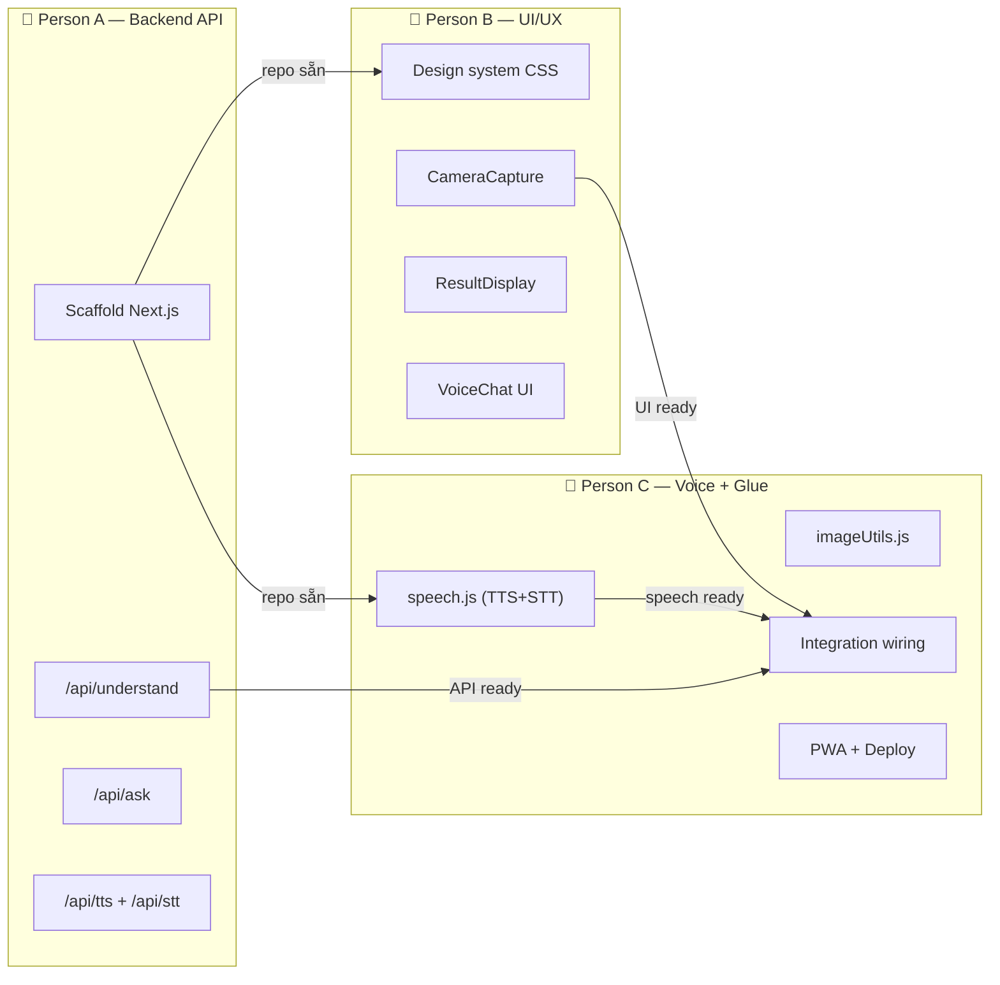

# 🏗️ Phân chia Task — 3 người song song

## Tổng quan phân công



---

## Giai đoạn 0: Setup chung (30 phút đầu — cả 3 cùng làm)

| Việc | Ai | Thời gian |
|---|---|---|
| Tạo repo GitHub, invite members | A | 5 phút |
| `npx create-next-app`, push lên | A | 10 phút |
| Tạo `.env.local` với `OPENAI_API_KEY` | A | 2 phút |
| Cả 3 clone repo, `npm install`, chạy `npm run dev` | A, B, C | 10 phút |
| **Thống nhất interface contracts** (xem bên dưới) | A, B, C | 5 phút |

> [!IMPORTANT]
> ### Interface Contracts — thống nhất TRƯỚC khi tách ra code
> Cả 3 phải đồng ý API shape để code song song mà không conflict:

**API Response shapes:**
```typescript
// POST /api/understand — Body: { image: "base64..." }
// Response:
{
  "raw_text": string,
  "type": "thuốc" | "hóa đơn" | "công văn" | "biểu mẫu" | "khác",
  "explanation": string,
  "key_points": string[]
}

// POST /api/ask — Body: { question: string, rawText: string }
// Response:
{ "answer": string }
```

**Component props:**
```typescript
// CameraCapture → gọi onCapture(base64String)
// ResultDisplay → nhận { rawText, type, explanation, keyPoints }
// VoiceChat → nhận { rawText }, gọi onNewMessage(question)
```

**Speech lib:**
```typescript
speak(text: string): void
startListening(): Promise<string>
stopListening(): void
hasVietnameseVoice(): boolean
```

---

## 👤 Person A — Backend API & OpenAI Integration

**Kỹ năng cần**: Biết Node.js, async/await, đọc API docs

| Giờ | Task | Definition of Done |
|---|---|---|
| 0.5 – 2 | `/api/understand/route.js` — GPT-4o vision | `curl` gửi ảnh base64 → nhận JSON đúng format |
| 2 – 3 | `/api/ask/route.js` — Q&A grounded | `curl` gửi question + rawText → nhận answer chỉ từ context |
| 3 – 4 | Error handling + edge cases | Ảnh không có text → lỗi thân thiện; timeout handling |
| 4 – 5 | `/api/tts/route.js` — OpenAI TTS fallback | `curl` gửi text → nhận audio stream |
| 5 – 6 | `/api/stt/route.js` — Whisper fallback | `curl` gửi audio → nhận text tiếng Việt |
| 6 – 7 | Tối ưu prompt, test với nhiều loại văn bản | Thử nhãn thuốc, hóa đơn, công văn — kết quả tốt |
| 7+ | Hỗ trợ C integration, fix bugs | API stable |

**Files Person A sở hữu:**
```
src/app/api/understand/route.js
src/app/api/ask/route.js
src/app/api/tts/route.js
src/app/api/stt/route.js
```

**Mock cho B & C test song song** (A làm trước trong 30 phút):
```javascript
// src/app/api/understand/route.js — mock version
export async function POST(req) {
  // Mock response để B và C test UI ngay, không cần đợi GPT-4o
  return Response.json({
    raw_text: "Paracetamol 500mg. Uống 2 viên × 3 lần/ngày sau ăn.",
    type: "thuốc",
    explanation: "Mỗi ngày uống 3 lần, mỗi lần 2 viên, uống sau khi ăn.",
    key_points: [
      "Mỗi lần uống 2 viên",
      "Ngày uống 3 lần",
      "Uống sau bữa ăn"
    ]
  });
}
```

---

## 👤 Person B — Frontend UI/UX

**Kỹ năng cần**: CSS, React components, responsive design

| Giờ | Task | Definition of Done |
|---|---|---|
| 0.5 – 1.5 | `globals.css` — design system (colors, fonts, spacing, buttons) | Dark mode, chữ to, nút 56px+ |
| 1.5 – 3 | `CameraCapture.js` — `<input capture>` + preview + nút | Chụp ảnh → thấy preview trên điện thoại |
| 3 – 4.5 | `ResultDisplay.js` — hiển thị explanation + key_points | Nhận mock data → hiển thị đẹp, chữ to |
| 4.5 – 6 | `VoiceChat.js` — chat bubbles UI + input area | Chat UI đẹp, nút mic to, input text fallback |
| 6 – 7 | `LoadingState.js` + `ErrorMessage.js` | Shimmer đẹp, lỗi thân thiện tiếng Việt |
| 7 – 8 | Polish: animations, transitions, micro-interactions | Hover effects, pulse mic, smooth transitions |
| 8+ | Test responsive trên nhiều kích thước điện thoại | Đẹp trên cả màn hình nhỏ 5" và lớn 6.7" |

**Files Person B sở hữu:**
```
src/app/globals.css
src/app/layout.js
src/components/CameraCapture.js
src/components/ResultDisplay.js
src/components/VoiceChat.js
src/components/LoadingState.js
src/components/ErrorMessage.js
```

> [!TIP]
> **B có thể test ngay với mock API** mà không cần đợi A xong. Chỉ cần hardcode mock data vào component lúc đầu, sau đó C sẽ wire lên API thật.

---

## 👤 Person C — Voice/Speech + Integration Glue

**Kỹ năng cần**: Web APIs (Speech, MediaRecorder), integration mindset, deploy

| Giờ | Task | Definition of Done |
|---|---|---|
| 0.5 – 2 | `speech.js` — TTS wrapper (Web Speech + detect vi-VN voice) | `speak("xin chào")` → nghe giọng Việt trên Chrome Android |
| 2 – 3 | `speech.js` — STT wrapper (Web Speech Recognition vi-VN) | `startListening()` → nói tiếng Việt → nhận text |
| 3 – 4 | `imageUtils.js` — resize + compress ảnh | File 5MB → base64 ~200KB, đủ nét cho OCR |
| 4 – 5.5 | `page.js` — **WIRING** 🔌 Kết nối tất cả components | Camera → API → Result → TTS → hoạt động end-to-end |
| 5.5 – 6.5 | Wire VoiceChat: STT → /api/ask → TTS response | Hỏi bằng giọng → nghe trả lời |
| 6.5 – 7.5 | Fallback logic: TTS fallback (OpenAI), STT fallback (record → /api/stt) | iOS/thiết bị thiếu voice vi-VN vẫn hoạt động |
| 7.5 – 8.5 | PWA manifest + service worker + deploy Vercel | App live trên URL, "Add to Home Screen" hoạt động |
| 8.5+ | End-to-end testing trên máy thật, fix bugs | Demo mượt |

**Files Person C sở hữu:**
```
src/app/page.js              ← Main page (glue logic)
src/lib/speech.js
src/lib/imageUtils.js
src/lib/api.js
public/manifest.json
public/sw.js
```

---

## Dependency Graph & Sync Points

```mermaid
gantt
    title Timeline 3 người song song
    dateFormat HH:mm
    axisFormat %H:%M

    section 👤 A — Backend
    Scaffold + Mock API         :a0, 00:00, 30m
    /api/understand (GPT-4o)    :a1, after a0, 90m
    /api/ask (grounded)         :a2, after a1, 60m
    Error handling              :a3, after a2, 60m
    /api/tts + /api/stt         :a4, after a3, 120m
    Prompt tuning + test        :a5, after a4, 60m

    section 👤 B — UI/UX
    Design system CSS           :b0, 00:30, 60m
    CameraCapture component     :b1, after b0, 90m
    ResultDisplay component     :b2, after b1, 90m
    VoiceChat UI                :b3, after b2, 90m
    Loading + Error + polish    :b4, after b3, 120m

    section 👤 C — Voice + Glue
    speech.js (TTS)             :c0, 00:30, 90m
    speech.js (STT)             :c1, after c0, 60m
    imageUtils.js               :c2, after c1, 60m
    🔌 WIRING page.js           :crit, c3, after c2, 90m
    Wire VoiceChat              :c4, after c3, 60m
    Fallback + PWA + Deploy     :c5, after c4, 120m

    section 🤝 Sync Points
    SYNC 1 - Mock API ready     :milestone, 00:30, 0m
    SYNC 2 - Vertical slice     :milestone, 04:00, 0m
    SYNC 3 - Full integration   :milestone, 06:30, 0m
```



### 3 Sync Points quan trọng

| Thời điểm | Sync Point | Ai cần gì từ ai |
|---|---|---|
| ⏱️ **Giờ 0.5** | **Mock API ready** | A push mock API → B & C clone, test ngay |
| ⏱️ **Giờ 4** | **🎯 Vertical Slice** | A có real API, B có UI, C wire lại → **chụp → hiểu → đọc to** phải chạy end-to-end |
| ⏱️ **Giờ 6.5** | **Full Integration** | Voice Q&A hoạt động, UI polish xong → feature complete |

> [!CAUTION]
> ### Tránh Git Conflict
> Mỗi người **CHỈ chạm vào files của mình**. Person C là người duy nhất edit `page.js` (file glue). Nếu cần thay đổi interface, **nói trong group chat trước**, đừng tự đổi.

---

## Chiến lược Git

```bash
# Branch strategy đơn giản cho hackathon:
main              ← chỉ merge code đã test
├── feat/backend  ← Person A
├── feat/ui       ← Person B
└── feat/voice    ← Person C

# Sync points: cả 3 merge vào main, pull latest
# Nếu conflict: C (integrator) resolve vì C hiểu full picture
```

**Quy tắc:**
1. Mỗi người làm trên branch riêng
2. Tại mỗi sync point → tất cả merge vào `main`
3. Person C merge cuối cùng (vì C wire mọi thứ)
4. Conflict → C resolve (C là integrator)

---

## Tóm tắt 1 dòng cho mỗi người

| Người | Một câu | Skill chính |
|---|---|---|
| **A** | "Tao lo backend, đảm bảo gửi ảnh vào thì ra JSON đúng" | Node.js, API, prompt engineering |
| **B** | "Tao lo giao diện đẹp, chữ to, nút to, cụ già xài được" | CSS, React, responsive design |
| **C** | "Tao lo giọng nói + nối tất cả lại với nhau + deploy" | Web APIs, integration, DevOps |
